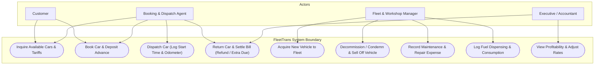
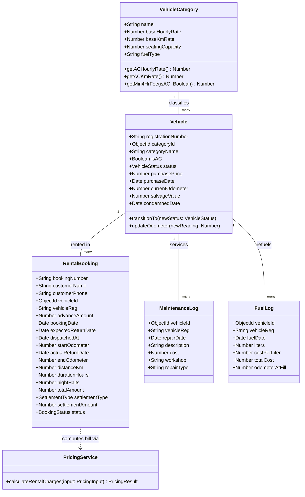
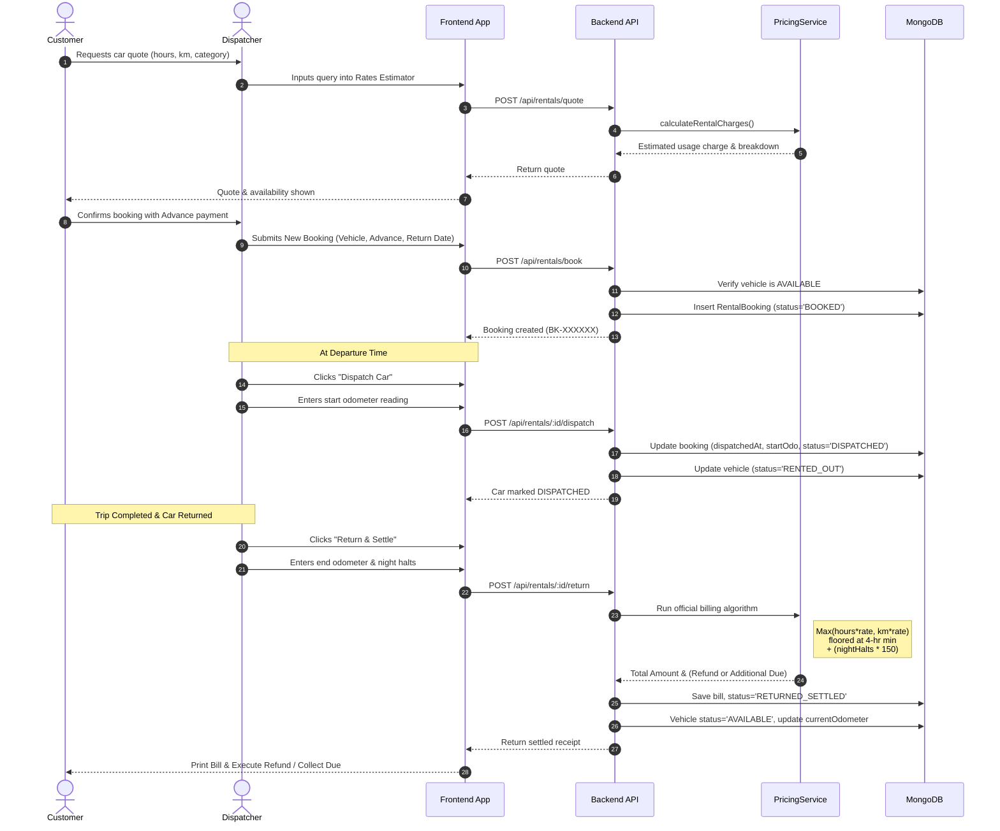
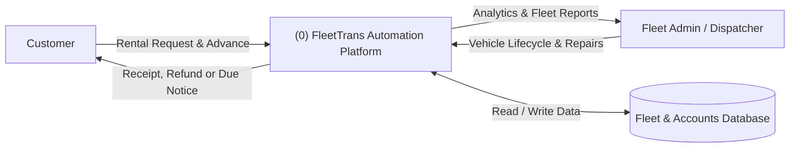
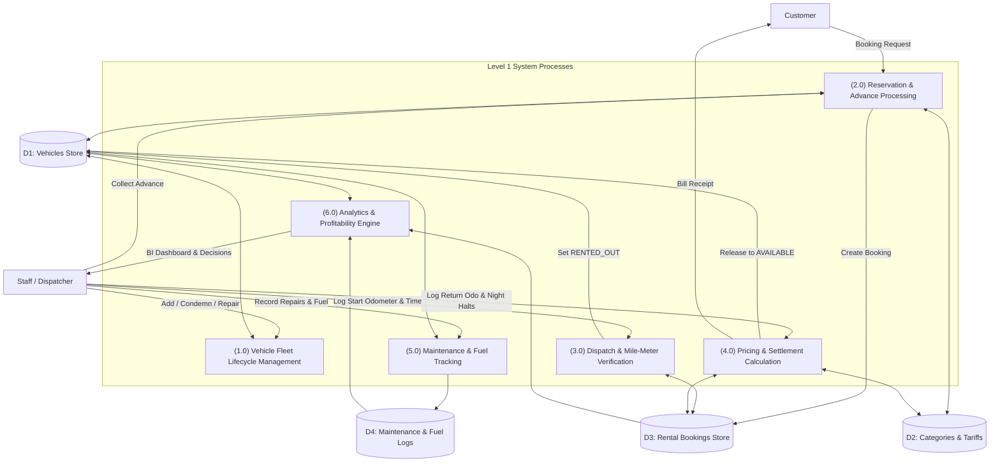
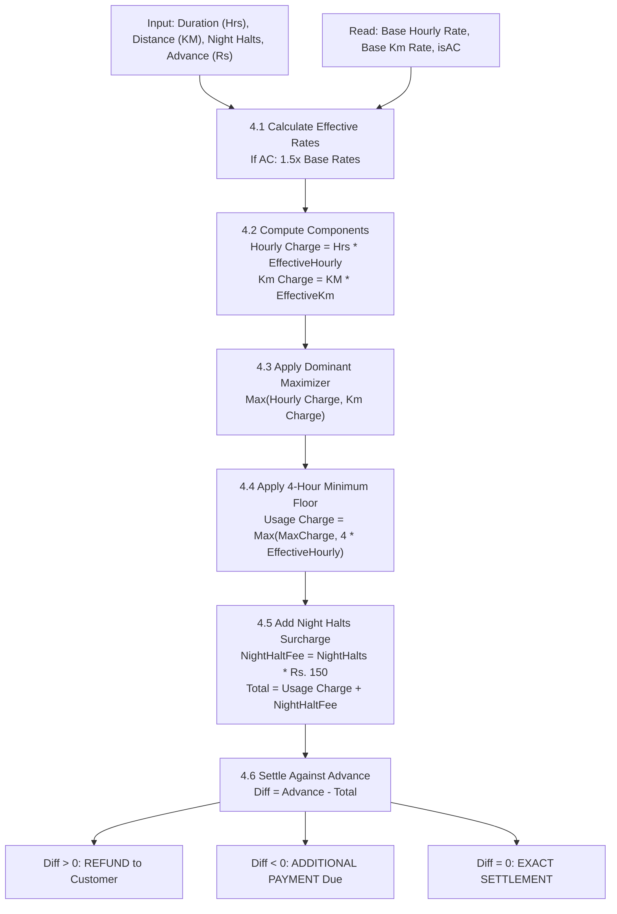

# Transport Fleet Automation System — Comprehensive Engineering Documentation

## 1. Executive Summary & Problem Scope

The Transport Fleet Automation System (**FleetTrans**) automates the fleet operations, rental bookings, rate calculation, vehicle lifecycle transitions, maintenance tracking, and business intelligence analytics for a commercial transport enterprise.

### Baseline Fleet Inventory
Per specifications, the initial company fleet comprises 52 vehicles across 5 primary categories:
| Vehicle Model | Non-AC Units | AC Units (+50% Rate) | Total Units | Seating | Fuel Type | Base Rates (Non-AC) |
|---|---|---|---|---|---|---|
| **Ambassador** | 10 | 2 | 12 | 5 Seats | Diesel | ₹90 / hr • ₹12 / km |
| **Tata Sumo** | 5 | 5 | 10 | 9 Seats | Diesel | ₹120 / hr • ₹15 / km |
| **Maruti Omni** | 10 | 0 | 10 | 8 Seats | Petrol | ₹75 / hr • ₹10 / km |
| **Maruti Esteem** | 0 | 10 | 10 | 5 Seats | Petrol | ₹110 / hr • ₹14 / km |
| **Mahindra Armada** | 10 | 0 | 10 | 8 Seats | Diesel | ₹115 / hr • ₹14 / km |
| **Total Fleet** | **35** | **17** | **52** | — | — | — |

---

## 2. System Architecture & Diagrams

### 2.1. Use Case Diagram
The system serves four primary roles: **Customer**, **Rental Dispatcher**, **Fleet/Workshop Manager**, and **Business Analyst / Executive**.

---

### 2.2. Class Diagram
The object model represents domain entities, associations, pricing logic, and state transitions.

---

### 2.3. Sequence Diagram (Rental Lifecycle: Quote $\rightarrow$ Booking $\rightarrow$ Dispatch $\rightarrow$ Return & Settle)

---

### 2.4. Data Flow Diagrams (DFD)

#### Level 0 DFD (Context Diagram)

#### Level 1 DFD (Decomposed System Processes)

#### Level 2 DFD (Process 4.0: Pricing & Financial Settlement Calculation)

---

## 3. Technology Stack

| Layer | Technology | Rationale & Architectural Fit |
|---|---|---|
| **Programming Language** | TypeScript (v5.7) | Full end-to-end type safety, eliminating runtime null/undefined traps across pricing and booking state logic. |
| **Backend Runtime** | Node.js (v20+ / v26) | High-performance asynchronous non-blocking event loop ideal for concurrent booking and dispatch requests. |
| **Backend Framework** | Express.js (v4.21) | Robust, battle-tested REST routing, JSON body parsing, and middleware pipeline. |
| **Database & ODM** | MongoDB + Mongoose (v8.9) | Document database allowing flexible storage of fleet attributes, nested trip logs, and high-performance aggregation pipelines for analytics. Dual-mode connection supports both custom MongoDB URIs and automatic embedded in-memory MongoDB (`mongodb-memory-server`) for zero-dependency execution. |
| **Testing Engine** | Vitest + Supertest | Blazing fast ESM unit tests and API integration testing. |
| **Frontend Framework** | React 19 + TypeScript | Component-based modern reactive UI. |
| **Build Tool** | Vite 6 | Instant hot module replacement (HMR) and optimized rollup production bundles. |
| **Styling & Design** | Tailwind CSS + Plus Jakarta Sans | Minimal, clean, modern UI optimized for readability and responsive operational workflows. |

---

## 4. Business Logic & Pricing Engine

### 4.1. Core Mathematical Formulation
1. **Air Conditioning (AC) Surcharge**:
   An AC car has rates 50% higher than the non-AC car of the same model:
   $$\text{Rate}_{\text{effective\_hr}} = \text{Rate}_{\text{base\_hr}} \times (1.5 \text{ if AC else } 1.0)$$
   $$\text{Rate}_{\text{effective\_km}} = \text{Rate}_{\text{base\_km}} \times (1.5 \text{ if AC else } 1.0)$$

2. **Minimum Rental Duration & Floor**:
   The minimum rental duration is **4 hours**. Minimum usage charge:
   $$\text{Charge}_{\text{min\_4hr}} = 4 \times \text{Rate}_{\text{effective\_hr}}$$

3. **Maximum Charge Selection**:
   $$\text{Charge}_{\text{hourly}} = \text{Hours Used} \times \text{Rate}_{\text{effective\_hr}}$$
   $$\text{Charge}_{\text{km}} = \text{Kilometers Run} \times \text{Rate}_{\text{effective\_km}}$$
   $$\text{Charge}_{\text{usage}} = \max\left(\max(\text{Charge}_{\text{hourly}}, \text{Charge}_{\text{km}}), \text{Charge}_{\text{min\_4hr}}\right)$$

4. **Night Halt Surcharge**:
   $$\text{Charge}_{\text{night\_halt}} = \text{Night Halts} \times 150$$
   $$\text{Charge}_{\text{total}} = \text{Charge}_{\text{usage}} + \text{Charge}_{\text{night\_halt}}$$

5. **Financial Settlement Against Advance Deposit**:
   $$\Delta = \text{Advance Paid} - \text{Charge}_{\text{total}}$$
   - If $\Delta > 0$: **REFUND** to customer of ₹$\Delta$.
   - If $\Delta < 0$: **ADDITIONAL PAYMENT** payable by customer of ₹$|\Delta|$.
   - If $\Delta = 0$: **EXACT SETTLEMENT**.

---

## 5. API Documentation

### Base URL: `http://localhost:5001/api`

#### Categories & Tariffs
- `GET /api/categories`: Returns all vehicle models, base rates, 1.5x AC rates, minimum 4-hour fees, and available fleet inventory counts.
- `PUT /api/categories/:id`: Updates base hourly and km rates for a category.
  - Body: `{ "baseHourlyRate": 95, "baseKmRate": 13 }`

#### Fleet Vehicles
- `GET /api/vehicles`: Retrieves vehicles list with query filters (`status`, `category`, `isAC`, `search`).
- `GET /api/vehicles/:id`: Retrieves full vehicle profile with maintenance history, fuel records, and lifetime rental revenue.
- `POST /api/vehicles`: Acquires and registers a new vehicle into the fleet.
  - Body: `{ "registrationNumber": "DL-01-XY-9000", "categoryId": "...", "isAC": true, "purchasePrice": 550000, "currentOdometer": 1000 }`
- `PATCH /api/vehicles/:id/status`: Directly toggles status between `AVAILABLE` and `UNDER_REPAIR`.
- `POST /api/vehicles/:id/condemn`: Condemns and sells off vehicle permanently, recording salvage value.
  - Body: `{ "salvageValue": 65000, "notes": "Engine block decommissioned" }`

#### Rental Operations
- `GET /api/rentals`: Lists rental bookings with optional `?status=` filter.
- `POST /api/rentals/quote`: Pure calculation simulator returning detailed bill breakdown without saving to DB.
- `POST /api/rentals/book`: Reserves an available car and collects advance deposit.
  - Body: `{ "customerName": "...", "customerPhone": "...", "vehicleId": "...", "expectedReturnDate": "2026-09-30T10:00:00Z", "advanceAmount": 2000 }`
- `POST /api/rentals/:id/dispatch`: Dispatches vehicle on trip; records departure timestamp and starting odometer; marks vehicle `RENTED_OUT`.
  - Body: `{ "dispatchedAt": "...", "startOdometer": 22450 }`
- `POST /api/rentals/:id/return`: Returns vehicle; validates ending odometer; runs pricing engine; calculates refund/additional payment; updates car odometer and sets status back to `AVAILABLE`.
  - Body: `{ "actualReturnDate": "...", "endOdometer": 22620, "nightHalts": 1 }`

#### Maintenance & Fuel
- `GET /api/maintenance`: Lists repair work orders and costs.
- `POST /api/maintenance`: Records maintenance expense with optional `setUnderRepair: true` flag.
- `GET /api/fuel`: Lists fuel logs and consumption totals.
- `POST /api/fuel`: Records fuel liters, rate per liter, and updates odometer.

#### Business Intelligence Analytics
- `GET /api/analytics/fleet-stats`: Aggregates fleet KPIs, model-by-model demand, average purchase price, repairs per car, fuel consumption, net profit, and managerial pricing recommendations.

---

## 6. Frontend Architecture & Automotive Design System

The frontend has been designed as a **luxury automotive rental platform and enterprise fleet operations portal** (**VELOCE Fleet & Travel Co.**), moving away from generic SaaS templates or institutional forms to an editorial visual language:

### 6.1. Visual Language & Tokens
- **Color Palette**:
  - `Charcoal & Black` (`#090a0b`, `#111215`): Deep, moody automotive negative space.
  - `Warm Ivory & Stone` (`#faf9f6`, `#f4f2ed`, `#e5e1d8`): Warm paper-like editorial backgrounds and primary surfaces.
  - `Champagne Bronze` (`#c5a880`): Sophisticated luxury automotive accent used for badges, active states, and highlights.
  - `Status Accents`: Subdued emerald, blue, and amber for operational statuses (`AVAILABLE`, `DISPATCHED`, `UNDER_REPAIR`).
- **Typography**:
  - `Playfair Display`: High-contrast editorial serif for commanding headlines (*"Your journey. Your car."*).
  - `Inter`: High-legibility functional sans-serif for forms, filters, and body text.
  - `JetBrains Mono`: High-precision monospace for vehicle registrations, odometer readings, and statutory tariff formulas.
- **Form Controls & Layout**:
  - Crisp, sharp borders (`border-stone-200`, `rounded-none`, `rounded-sm`) replacing bubbly rounded pill buttons.
  - Generous negative space and cinematic open-road photography.

### 6.2. Component Hierarchy & Workflows

| Component | Visual & Functional Role | Key Operations & Interactions |
|---|---|---|
| **1. Navbar** (`Navbar.tsx`) | Executive top navigation & live fleet custody indicator | Fixed backdrop blur masthead with brand wordmark, quick section links, "Fleet Ops (Ready count)" button, and "Reserve Vehicle" CTA. |
| **2. Hero & Booking Search** (`Hero.tsx` + `BookingSearch.tsx`) | Cinematic automotive billboard & quick route selector | Moody atmospheric photography, editorial headline, pick-up hub, return hub, datetime pickers, AC preference toggle, and instant reservation trigger. |
| **3. The Fleet Catalogue** (`FleetSection.tsx`) | Curated vehicle catalogue grid | Filter by vehicle category (Ambassador, Tata Sumo, Omni, Esteem, Armada), AC/Non-AC, and availability. Displays technical specifications, hourly/km rate cards, and statutory 4-hour floor fee. |
| **4. Tariff Codex & Rate Engine** (`HowItWorksSection.tsx`) | Rule explanation & live fare simulator | Details the 3 core rules (4-hr floor, AC surcharge +50%, demurrage ₹150 flat). Features a live interactive tariff calculator where users adjust hours, km, AC, night halts, and advance to preview the exact dual-metric bill outcome. |
| **5. Destinations Guide** (`LocationsSection.tsx`) | Curated driving corridors (*"Where will you go?"*) | Editorial cards for iconic routes (Heritage Triangle, Himalayan Ridge, Konkan Coast) with distance specs and recommended vehicle classes. |
| **6. Operational Guarantees** (`TrustSection.tsx`) | Concrete commitment ledger | Highlights 4 statutory pillars: 4-Hr Minimum, Dual-Metric Formula, Certified Stewardship, and Uniform Demurrage. |
| **7. Vehicle Catalogue Dossier** (`VehicleDetailModal.tsx`) | Two-column editorial dossier modal | High-resolution photography, registration docket, technical specifications (engine, drivetrain, fuel, transmission, seating), full tariff breakdown, and reserve trigger. |
| **8. Multi-Step Reservation Flow** (`BookingFlowModal.tsx`) | Professional 5-step booking experience | Step 1 (Dates & Hubs) → Step 2 (Select Vehicle & Category) → Step 3 (Driver License & Advance Deposit) → Step 4 (Deterministic Rate Review) → Step 5 (Certified Printable Booking Voucher with Docket #). |
| **9. Fleet Operations Workspace** (`OperationsWorkspace.tsx`) | Back-office dispatcher & accountant portal | Full modal containing: (1) Dispatch & Return Manifest with departure odometer logging, night halts, and official settlement receipt generator (refund/balance due); (2) Fleet Asset Registry with Add Vehicle & Condemn/Sell Off; (3) Workshop Service Work Orders & Fuel Consumption Logging; (4) Fleet Business Intelligence & Profitability. |
| **10. Substantial Footer** (`Footer.tsx`) | Editorial footer & legal statutory notices | Operating hubs, category navigation, legal tariffs notice, live system health heartbeat indicator, and quick modal triggers. |

---

## 7. Test Cases Matrix & Fallacy Analysis

### 7.1. Backend Domain & Business Logic Edge Cases
1. **Short Duration Trip (< 4 hours)**:
   - *Test Scenario*: Customer returns car after 1.5 hours and 10 km.
   - *Expected Behavior*: Hourly charge = 1.5 × Rate, Km charge = 10 × KmRate. Both are below the 4-hour floor ($4 \times \text{Rate}$). Bill is floored at exactly 4 hours.
   - *Test Status*: ✅ **Verified in Vitest suite (`pricingService.test.ts`)**.

2. **Distance-Dominated Trip (KM > Hourly)**:
   - *Test Scenario*: Outstation express run: 5 hours, 350 km.
   - *Expected Behavior*: KM charge exceeds Hourly charge; billing engine automatically selects KM charge.
   - *Test Status*: ✅ **Verified in Vitest suite**.

3. **Time-Dominated Trip (Hourly > KM)**:
   - *Test Scenario*: City traffic / VIP waiting: 14 hours, 25 km.
   - *Expected Behavior*: Hourly charge dominates over KM charge.
   - *Test Status*: ✅ **Verified in Vitest suite**.

4. **AC 50% Rate Multiplier Verification**:
   - *Test Scenario*: Same duration and distance on Non-AC Tata Sumo vs AC Tata Sumo.
   - *Expected Behavior*: AC vehicle rates are exactly $1.5\times$ base rates for both hourly and km calculations.
   - *Test Status*: ✅ **Verified in Vitest suite**.

5. **Night Halt Flat Fee**:
   - *Test Scenario*: Trip spanning 2 calendar nights.
   - *Expected Behavior*: Adds exactly $2 \times ₹150 = ₹300$ regardless of whether the car is an economy Omni or a premium Esteem.
   - *Test Status*: ✅ **Verified in Vitest suite**.

6. **Mile-Meter Rollback Prevention**:
   - *Test Scenario*: Dispatch odometer was 50,000 km. Return submitted with 49,800 km.
   - *Expected Behavior*: API rejects with HTTP 400 Bad Request (`End mile-meter reading cannot be less than starting reading`).
   - *Test Status*: ✅ **Verified in Supertest integration suite (`api.integration.test.ts`)**.

7. **Vehicle State Concurrency Guard**:
   - *Test Scenario*: Attempting to dispatch a vehicle that is already `RENTED_OUT` or `UNDER_REPAIR`.
   - *Expected Behavior*: API returns HTTP 400 Bad Request preventing double-dispatch.
   - *Test Status*: ✅ **Verified in Supertest integration suite**.

---

### 7.2. Frontend Edge Cases
1. **Zero Available Vehicles in Fleet**:
   - *Edge Case*: If all vehicles in a category are rented or under repair.
   - *UI Behavior*: The booking dropdown filters only `AVAILABLE` vehicles. If no vehicles are available, the user receives an alert and cannot submit empty bookings.
2. **Negative Currency / Negative Distance Inputs**:
   - *UI Behavior*: Input fields have HTML5 and React constraint validation (`min={0}`, `min={1}`) preventing negative duration, km, advance, or night halts.
3. **Floating Point Arithmetic Traps in Currency**:
   - *UI Behavior*: All rate and fee calculations are rounded using `toFixed(2)` and parsed to clean numeric floats before presentation, preventing IEEE 754 precision artifacts (e.g. ₹150.00000000000003).

---

### 7.3. Integration Fallacies & Resilience Strategies
1. **Network Retries & Double Billing Fallacy**:
   - *Fallacy*: If a network hiccup occurs while returning a car, a user might click "Settle" twice.
   - *Resilience*: The backend enforces an atomic state check: once returned, booking status transitions from `DISPATCHED` to `RETURNED_SETTLED`. A second call fails immediately with HTTP 400 (`Only currently dispatched rentals can be returned`).
2. **Zero-Configuration Standalone Database Portability**:
   - *Fallacy*: If the application is deployed on a machine without a running `mongod` service, the backend would crash on startup.
   - *Resilience*: The database configuration module (`src/config/db.ts`) detects if a MongoDB instance is available; if not, it automatically boots an embedded in-memory MongoDB engine (`mongodb-memory-server`) and seeds the 52 vehicles immediately.
3. **Odometer Desynchronization**:
   - *Fallacy*: Maintenance or fuel fill-ups occur between rentals where the vehicle was driven to a workshop.
   - *Resilience*: When fuel logs are submitted with a higher odometer reading, the vehicle's `currentOdometer` is automatically updated to preserve odometer continuity.
