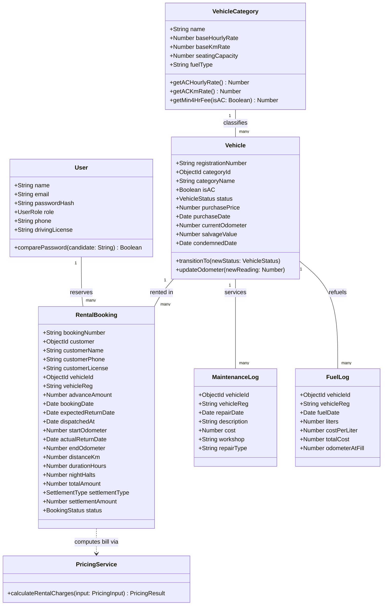
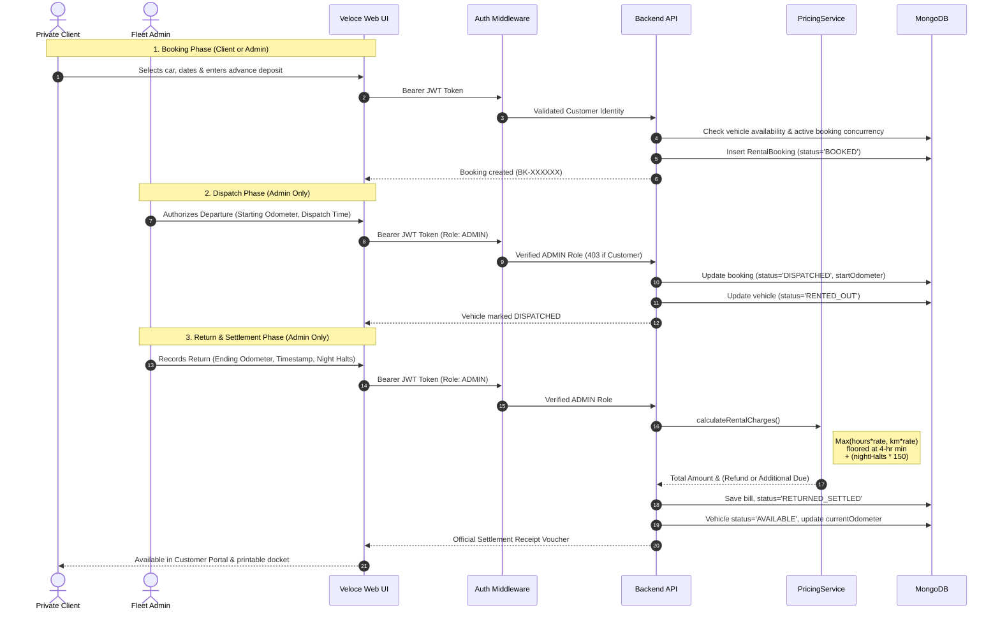
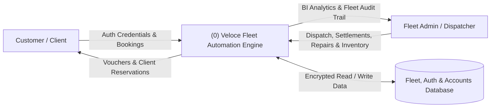
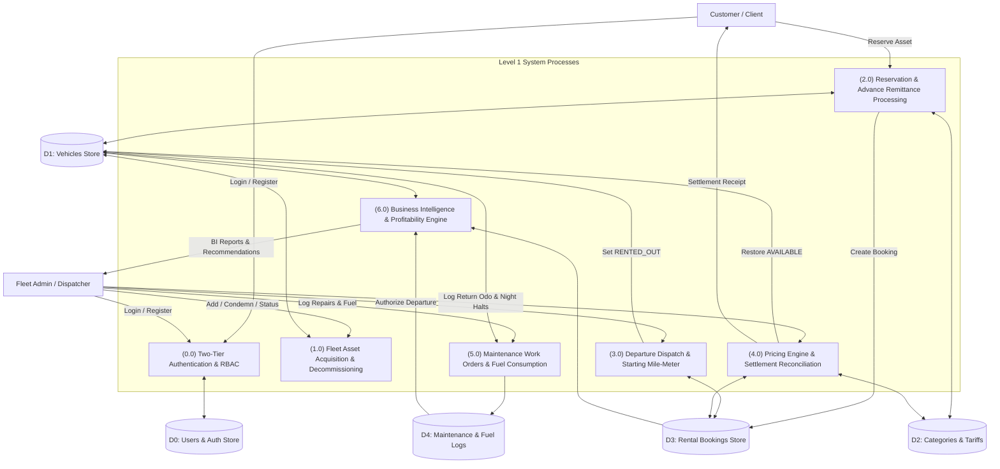

# Transport Fleet Automation System — Comprehensive Engineering Documentation

## 1. Executive Summary & Problem Scope

The Transport Fleet Automation System (**FleetTrans / Veloce Fleet**) automates fleet operations, rental bookings, rate calculation, vehicle lifecycle transitions, maintenance tracking, financial settlements, and business intelligence analytics for a commercial transport enterprise.

The system incorporates **two-tier role-based access control (RBAC)** to provide segregated operational boundaries:
* **Private Clients / Customers**: Browse curated fleet assets, calculate dual-formula fare quotes, execute self-service reservations with advance deposits, and manage their personal reservations ledger in a dedicated client portal.
* **Fleet Operations / Administrators**: Authorize vehicle departures (dispatch), verify return odometers, calculate statutory billing settlements (refunds / balance due), acquire new fleet assets, decommission/condemn vehicles, record workshop work orders and fuel dispensation, adjust master tariff rates, and analyze profit margins.

### Baseline Fleet Inventory
Per specifications, the initial company fleet comprises 52 vehicles across 5 primary categories:
| Vehicle Model | Non-AC Units | AC Units (+50% Rate) | Total Units | Seating | Fuel Type | Base Rates (Non-AC) |
|---|---|---|---|---|---|---|
| **Ambassador** | 10 | 2 | 12 | 5 Seats | Diesel | ₹90 / hr • ₹12 / km |
| **Tata Sumo** | 5 | 5 | 10 | 9 Seats | Diesel | ₹120 / hr • ₹15 / km |
| **Maruti Omni** | 10 | 0 | 10 | 8 Seats | Petrol | ₹75 / hr • ₹10 / km |
| **Maruti Esteem** | 0 | 10 | 10 | 5 Seats | Petrol | ₹110 / hr • ₹14 / km |
| **Mahindra Armada** | 10 | 0 | 10 | 8 Seats | Diesel | ₹115 / hr • ₹14 / km |
| **Total Fleet** | **35** | **17** | **52** | — | — | — |

---

## 2. System Architecture & Diagrams

### 2.1. Use Case Diagram (Two-Tier Role-Based Separation)

```mermaid
flowchart TD
    subgraph Actors
        C["Private Client / Customer"]
        A["Fleet Admin / Dispatcher"]
    end

    subgraph "Customer Operations (Client Portal)"
        UC1(["Browse Fleet & Rates"])
        UC2(["Simulate Tariffs (Live Dual-Formula)"])
        UC3(["Book Car & Remit Advance Deposit"])
        UC4(["View Personal Bookings & Settlement Vouchers"])
    end

    subgraph "Administrative Operations (Operations Desk)"
        UC5(["Authorize Departure / Dispatch Vehicle"])
        UC6(["Inspect Vehicle Return & Execute Settlement"])
        UC7(["Enrol / Acquire New Vehicle"])
        UC8(["Condemn & Sell Off Asset"])
        UC9(["Log Workshop Repairs & Ground Vehicle"])
        UC10(["Record Fuel Dispensation & Odometer"])
        UC11(["Inspect Fleet BI & Profitability"])
        UC12(["Adjust Master Category Tariff Rates"])
    end

    C --> UC1
    C --> UC2
    C --> UC3
    C --> UC4

    A --> UC1
    A --> UC2
    A --> UC5
    A --> UC6
    A --> UC7
    A --> UC8
    A --> UC9
    A --> UC10
    A --> UC11
    A --> UC12
```

---

### 2.2. Class Diagram

---

### 2.3. Sequence Diagram (Authenticated Rental Lifecycle)

---

### 2.4. Data Flow Diagrams (DFD)

#### Level 0 DFD (Context Diagram)

#### Level 1 DFD (Decomposed System Processes)

---

## 3. Technology Stack

| Layer | Technology | Architectural Purpose & Rationale |
|---|---|---|
| **Programming Language** | TypeScript (v5.7) | End-to-end type safety, eliminating runtime type coercion traps and `NaN` propagation across pricing, forms, and trip logs. |
| **Backend Runtime** | Node.js (v20+ / v26) | Asynchronous event loop optimized for high-concurrency booking and fleet dispatching. |
| **Backend Framework** | Express.js (v4.21) | REST routing, middleware pipelines (JWT verification, role guardrails, error handlers). |
| **Security & Auth** | JSON Web Tokens (`jsonwebtoken`) + `bcryptjs` | Stateless token-based authentication with salted SHA-256 password hashing. |
| **Database & ODM** | MongoDB + Mongoose (v8.9) | Document store for fleet inventories and trip manifests. Automatic embedded in-memory fallback (`mongodb-memory-server`) ensures zero-dependency local execution. |
| **Testing Suite** | Vitest + Supertest | Rapid unit and end-to-end integration testing (29 test cases covering business rules, RBAC, and boundary validation). |
| **Frontend Framework** | React 19 + TypeScript | Reactive state management and modern functional component architecture. |
| **Build Pipeline** | Vite 6 | Production-optimized ESM bundling, instant Hot Module Replacement (HMR). |
| **Design System** | Tailwind CSS + Playfair Display + JetBrains Mono | Luxury automotive editorial styling (`#090a0b`, `#c5a880`, `#faf9f6`). |

---

## 4. Business Logic & Pricing Engine

### 4.1. Core Mathematical Formulation
1. **Air Conditioning (AC) Surcharge**:
   An AC car has rates 50% higher ($1.5\times$) than a non-AC car of the same model:
   $$\text{Rate}_{\text{effective\_hr}} = \text{Rate}_{\text{base\_hr}} \times (1.5 \text{ if AC else } 1.0)$$
   $$\text{Rate}_{\text{effective\_km}} = \text{Rate}_{\text{base\_km}} \times (1.5 \text{ if AC else } 1.0)$$

2. **Statutory Minimum Rental Duration (4-Hour Floor)**:
   The statutory minimum rental duration is **4 hours**. Minimum usage charge:
   $$\text{Charge}_{\text{min\_4hr}} = 4 \times \text{Rate}_{\text{effective\_hr}}$$

3. **Maximum Charge Selection**:
   $$\text{Charge}_{\text{hourly}} = \text{Hours Used} \times \text{Rate}_{\text{effective\_hr}}$$
   $$\text{Charge}_{\text{km}} = \text{Kilometers Run} \times \text{Rate}_{\text{effective\_km}}$$
   $$\text{Charge}_{\text{usage}} = \max\left(\max(\text{Charge}_{\text{hourly}}, \text{Charge}_{\text{km}}), \text{Charge}_{\text{min\_4hr}}\right)$$

4. **Night Halt Flat Surcharge**:
   An overnight charge of ₹150 applies per night halt regardless of vehicle category:
   $$\text{Charge}_{\text{night\_halt}} = \text{Night Halts} \times 150$$
   $$\text{Charge}_{\text{total}} = \text{Charge}_{\text{usage}} + \text{Charge}_{\text{night\_halt}}$$

5. **Financial Settlement Against Advance Deposit**:
   $$\Delta = \text{Advance Deposited} - \text{Charge}_{\text{total}}$$
   * If $\Delta > 0$: **REFUND** payable to the customer of ₹$\Delta$.
   * If $\Delta < 0$: **ADDITIONAL PAYMENT** due from the customer of ₹$|\Delta|$.
   * If $\Delta = 0$: **EXACT SETTLEMENT**.

---

## 5. Complete REST API Specifications

### Base URL: `http://localhost:5001/api`

### 5.1. Authentication & Access Control (Public)
* `POST /api/auth/register`: Creates a customer or administrator account.
  * *Request Body*: `{ "name": "Marcus Sterling", "email": "marcus@veloce.com", "password": "password123", "role": "CUSTOMER", "phone": "+91 98765 43210" }`
  * *Validation*: Valid email format (`EMAIL_REGEX`), `name.length >= 2`, `password.length >= 6`.
* `POST /api/auth/login`: Authenticates user credentials and returns JWT bearer token.
  * *Request Body*: `{ "email": "admin@velocefleet.com", "password": "admin123" }`
* `GET /api/auth/me`: Returns profile of the currently authenticated token subject.
* `POST /api/auth/demo-login`: 1-Click instant demo login for evaluation.
  * *Request Body*: `{ "role": "ADMIN" | "CUSTOMER" }`

### 5.2. Vehicle Categories & Tariffs (Public Read / Admin Write)
* `GET /api/categories`: Returns all vehicle models, rates, 1.5x AC rates, and inventory counts.
* `PUT /api/categories/:id` *(ADMIN Only)*: Updates base tariffs for a category.
  * *Request Body*: `{ "baseHourlyRate": 95, "baseKmRate": 13 }`
  * *Validation*: Both rates must be positive finite numbers (`rate > 0 && !isNaN(rate)`).

### 5.3. Fleet Vehicles (Public Read / Admin Write)
* `GET /api/vehicles`: Returns vehicles with optional filters (`status`, `category`, `isAC`, `search`).
* `GET /api/vehicles/:id`: Returns full vehicle profile, maintenance logs, fuel logs, and trip revenue.
* `POST /api/vehicles` *(ADMIN Only)*: Acquires and adds a new asset to the fleet.
  * *Request Body*: `{ "registrationNumber": "DL-01-XY-9000", "categoryId": "...", "isAC": true, "purchasePrice": 550000, "currentOdometer": 1000 }`
  * *Validation*: Unique registration (length $\ge 3$), purchase price $> 0$, odometer $\ge 0$.
* `PATCH /api/vehicles/:id/status` *(ADMIN Only)*: Toggles status between `AVAILABLE` and `UNDER_REPAIR`.
  * *Validation*: Blocks updating vehicles that are currently rented or booked.
* `POST /api/vehicles/:id/condemn` *(ADMIN Only)*: Decommissions and sells off asset permanently.
  * *Request Body*: `{ "salvageValue": 65000, "notes": "Engine decommissioned" }`
  * *Validation*: Non-negative salvage value; rejects vehicles currently booked or dispatched.

### 5.4. Rental Operations
* `GET /api/rentals` *(ADMIN Only)*: Returns complete manifest of all bookings.
* `GET /api/rentals/my-bookings` *(CUSTOMER & ADMIN)*: Returns personal bookings for the logged-in customer.
* `POST /api/rentals/quote` *(Public)*: Live fare simulator returning bill breakdown without saving to DB.
* `POST /api/rentals/book` *(Authenticated)*: Reserves an available vehicle and deposits advance.
  * *Request Body*: `{ "customerName": "...", "customerPhone": "...", "vehicleId": "...", "expectedReturnDate": "2026-10-10T12:00:00Z", "advanceAmount": 2500 }`
  * *Validation*: Future return date, active booking concurrency lock, advance $> 0$, name $\ge 2$ chars.
* `POST /api/rentals/:id/dispatch` *(ADMIN Only)*: Authorizes departure.
  * *Request Body*: `{ "dispatchedAt": "2026-10-06T09:00:00Z", "startOdometer": 24000 }`
  * *Validation*: Starting odometer $\ge$ vehicle's registered odometer; dispatch time $\ge$ booking date.
* `POST /api/rentals/:id/return` *(ADMIN Only)*: Settles rental upon vehicle re-entry.
  * *Request Body*: `{ "actualReturnDate": "2026-10-08T14:00:00Z", "endOdometer": 24280, "nightHalts": 2 }`
  * *Validation*: End odometer $\ge$ start odometer; return time $\ge$ dispatch time; non-negative night halts.

### 5.5. Maintenance, Fuel & Business Intelligence (ADMIN Only)
* `GET /api/maintenance`: Lists all workshop work orders and costs.
* `POST /api/maintenance`: Records maintenance expense (rejects condemned vehicles; cost $> 0$).
* `GET /api/fuel`: Lists fuel logs and consumption totals.
* `POST /api/fuel`: Records fuel dispensation (liters $> 0$, cost $> 0$, odometer $\ge$ vehicle current odometer).
* `GET /api/analytics/fleet-stats`: Aggregates fleet KPIs, revenue, repairs, fuel costs, net profits, and pricing recommendations.

---

## 6. Frontend Architecture & Design System

The frontend is crafted in a **luxury automotive design aesthetic** (**VELOCE Fleet & Travel Co.**):

### 6.1. Visual Tokens
* **Color Palette**: Deep Charcoal (`#090a0b`, `#111215`), Warm Paper Stone (`#faf9f6`, `#f4f2ed`), Champagne Bronze (`#c5a880`), Status Emerald/Amber/Rose.
* **Typography**: *Playfair Display* (Editorial Headlines), *Inter* (Legible Controls & Body), *JetBrains Mono* (Asset IDs, Odometer & Tariffs).
* **Styling**: Sharp, crisp architectural borders (`border-stone-200`, `border-white/10`), generous negative space, and responsive viewports.

### 6.2. Component Roles
1. **`Navbar.tsx`**: Executive top navigation with live fleet custody indicator, 1-click authentication triggers, and role-adaptive portal switches.
2. **`Hero.tsx` & `BookingSearch.tsx`**: Cinematic automotive billboard with instant date-validated route search bar.
3. **`FleetSection.tsx`**: Curated vehicle catalogue grid with category, climate, and availability filters.
4. **`HowItWorksSection.tsx`**: Dual-metric tariff codex with live interactive fare simulator.
5. **`LocationsSection.tsx` & `TrustSection.tsx`**: Driving corridor guides and statutory operational commitments.
6. **`BookingFlowModal.tsx`**: 5-step client reservation flow with client-side validation of departure/return dates, minimum 4-hour rental duration, driver phone digits, and advance deposits.
7. **`OperationsWorkspace.tsx`**: Pinned multi-tab fleet administration console with strict `isAdmin` protection, tab navigation with `shrink-0`/`min-h-0` layout stability, and inline validation error banners.
8. **`CustomerPortalModal.tsx`**: Client-exclusive reservation docket displaying booking statuses (`CONFIRMED BOOKING`, `ON VOYAGE`, `SETTLED & RETURNED`) and official billing receipts.
9. **`AuthModal.tsx`**: Two-tier login/registration modal with 1-click instant evaluation access for both `ADMIN` and `CLIENT`.

---

## 7. Quality Assurance, Edge Cases & Validation Matrix

### 7.1. Comprehensive Form Validation Matrix

| Form / Feature | Validated Fields | Edge Cases Handled | Illegal Inputs Rejected |
|---|---|---|---|
| **User Sign-In** | Email, Password | Case-insensitive emails, trimming | Invalid email format, passwords $< 6$ characters |
| **User Registration** | Name, Email, Password, Phone | Multi-word names, international phone formats | Names $< 2$ chars, passwords $< 6$ chars, malformed emails, phones $< 7$ digits |
| **Hero Booking Search** | Pickup date, Return date | Same-hub vs cross-hub routing | Past pickup dates, return dates $\le$ pickup dates, durations $< 4$ hours |
| **Vehicle Reservation** | Pickup date, Return date, Advance, Driver details | 4-Hour minimum floor, driver profile auto-fill | Concurrency double-booking of active assets, advance $\le 0$, `NaN` deposit, past dates |
| **Vehicle Dispatch** | Starting Odometer, Dispatch timestamp | Odometer progression consistency | Starting odometer $<$ current vehicle odometer, dispatch time $<$ booking date |
| **Vehicle Return & Settlement** | Return Odometer, Return timestamp, Night halts | Reversible advance reconciliation (refund / extra payment due) | Ending odometer $<$ starting odometer, return time $<$ dispatch time, negative night halts, `NaN` math traps |
| **Vehicle Acquisition** | Reg #, Category, Purchase price, Start odometer | Unique registration check, AC configuration | Reg numbers $< 3$ chars, duplicate reg #, purchase price $\le 0$, negative odometer |
| **Asset Condemnation** | Salvage value, Notes | Asset decommissioning audit trail | Condemning vehicles currently rented out or reserved, negative salvage value, re-condemning sold assets |
| **Workshop Work Order** | Description, Cost, Workshop facility, Grounding | Optional vehicle grounding to `UNDER_REPAIR` | Cost $\le 0$, empty descriptions, servicing already-sold/condemned vehicles |
| **Fuel Dispensation** | Liters, Cost/Liter, Odometer at fill | Automatic vehicle odometer update on fill-up | Liters $\le 0$, cost $\le 0$, odometer lower than current vehicle odometer, fueling condemned cars |
| **Tariff Master Adjustment** | Hourly rate, Km rate | Dynamic update of AC rates and 4-hr floors | Hourly rate $\le 0$, Km rate $\le 0$, `NaN` values |

### 7.2. Automated Test Suite Metrics
The automated test suite runs via Vitest and Supertest across 3 test files with **29 total tests**:
* **Database Connection Suite** (`src/config/db.test.ts`): Embedded in-memory MongoDB verification.
* **Pricing Engine Suite** (`src/services/pricingService.test.ts`): Mathematical validation of 4-hour floor, KM dominance, duration dominance, AC multiplier, and refund/additional payment formulas.
* **End-to-End RBAC & API Suite** (`src/tests/api.integration.test.ts`):
  1. *Authentication & Two-Tier Access Roles* (Registration, login, demo-login, profile fetch).
  2. *Public Catalogue Inspection* (Categories and seeded fleet queries without credentials).
  3. *Role Access Segregation & Guardrails* (Rejects customers with 403 on dispatch, BI, and vehicle acquisition).
  4. *Admin Fleet Operations* (Vehicle acquisition, status toggling, asset condemnation).
  5. *Customer Booking & Dispatch Settlement Lifecycle* (Reservation, personal booking queries, dispatch, return with refund).
  6. *Maintenance, Fuel & Analytics* (Work orders, refueling, financial BI).
  7. *Validation, Edge Cases & Illegal Values Robustness* (Invalid emails, short passwords, negative advances, past return dates, short registration numbers, negative maintenance costs, odometer rollbacks, and negative category tariffs).

**Result**: All **29 tests passing** (`100% pass rate`).
